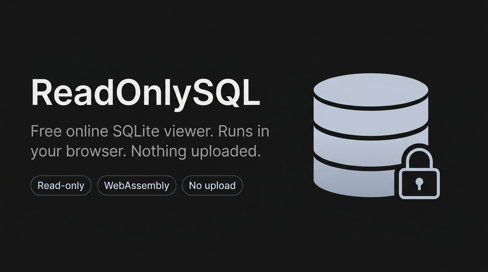
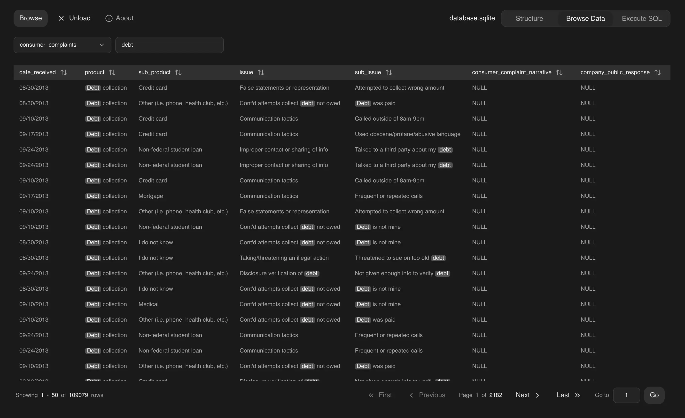

> **Educational project**, in **very early stages** of development. You’re welcome
> to try this live. (<a href="https://readonlysql.com"><strong>readonlySQL.com</strong></a>)

<p align="center">
  
 </p>

Browser-only, read-only SQLite viewer. Drop a `.sqlite` or `.db` file to
inspect schema, browse rows, and run read-only SQL. The file
is loaded in memory in a Web Worker via [sql.js](https://sql.js.org).

<p align="center">
  <a href="https://readonlysql.com">
    
  </a>
</p>

## Features

- **Structure** — tables, indexes, views, triggers with SQL definitions
- **Browse** — paginated view, global filter, column sort and resize
- **SQL** — read-only query runner with timing and row/column counts
- **Read-only guard** — `SELECT`, `WITH`, `EXPLAIN`, and allowlisted
  introspection `PRAGMA` only; runs wrapped in `SAVEPOINT` / `ROLLBACK`
- **Large files** — up to ~500 MB

## Constraints

- `WITH` clauses that contain `INSERT` / `UPDATE` / `DELETE` / `REPLACE` are
  rejected
- `PRAGMA` assignments are rejected; introspection `PRAGMA` only
- One statement per execution (no multi-statement scripts)

## Development

Requires Node 20+.

```bash
npm install
npm run dev
npm run build
npm run lint
npm run preview
```

## Stack

- React 19, TypeScript
- Vite, Tailwind CSS v4
- sql.js in a Web Worker
- Radix (Tabs, Slot), Lucide icons
