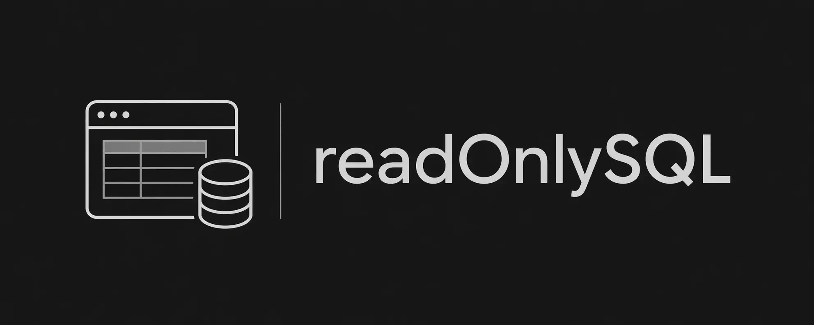
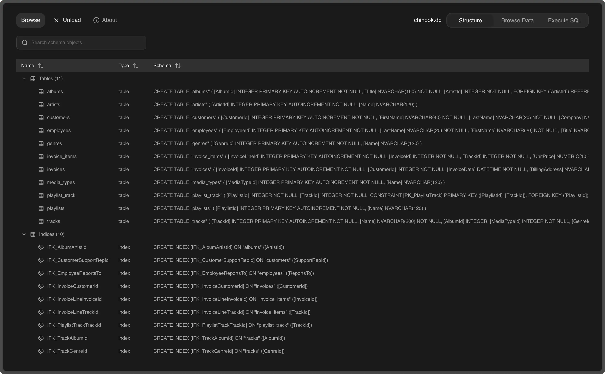
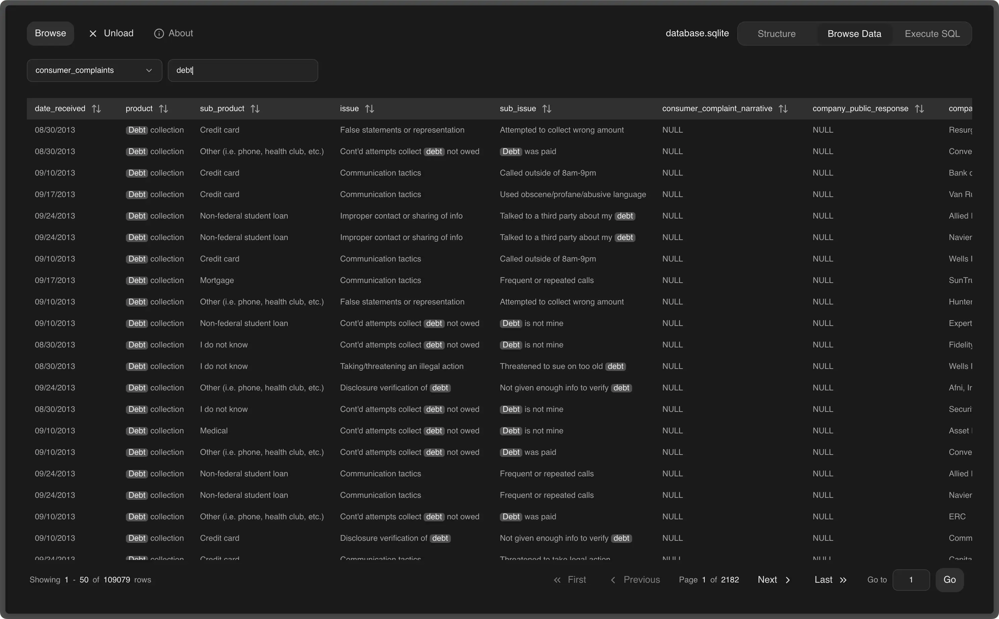
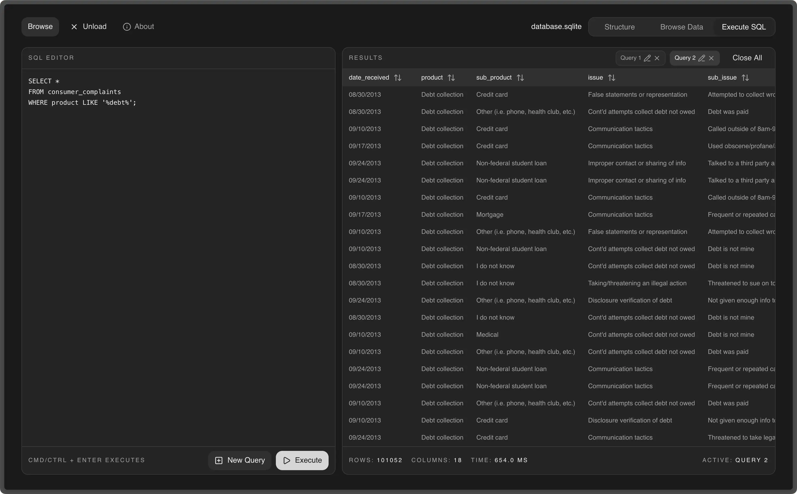

  
  

Browser-only, read-only SQLite viewer. Drop a `.sqlite` or `.db` file to
inspect schema, browse rows, and run read-only SQL. The file
is loaded in memory in a Web Worker via [sql.js](https://sql.js.org).

## Features

- **Structure** — tables, indexes, views, triggers with SQL definitions
- **Browse** — paginated view, global filter, column sort and resize
- **SQL** — read-only query runner with timing and row/column counts
- **Read-only guard** — `SELECT`, `WITH`, `EXPLAIN`, and allowlisted
  introspection `PRAGMA` only; runs wrapped in `SAVEPOINT` / `ROLLBACK`
- **Large files** — up to ~500 MB

## Constraints

- `WITH` clauses that contain `INSERT` / `UPDATE` / `DELETE` / `REPLACE` are
  rejected
- `PRAGMA` assignments are rejected; introspection `PRAGMA` only
- One statement per execution (no multi-statement scripts)

## Showcase

### Structure

  

### Browse Data

  

### Execute SQL

  

## Stack

- React 19, TypeScript
- Vite, Tailwind CSS v4
- sql.js in a Web Worker
- Radix (Tabs, Slot), Lucide icons
